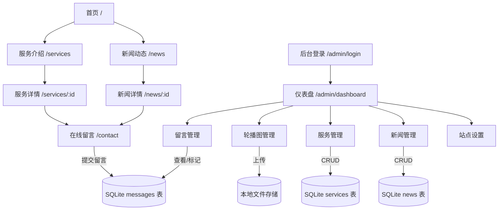

# PRD：万家官网管家 —— 本地服务企业官网 + 轻量 CMS

## 1. 产品定位

**产品名称**：万家官网管家

**一句话痛点**：帮家政/装修/律所等本地服务企业 30 分钟上线一个"能改内容、能收线索"的官网，告别找开发改一个字等一周的窘境。

**目标用户画像**：

| 角色 | 典型场景 |
|------|---------|
| 李姐（家政公司老板） | 公司只有 5 个阿姨，想做官网展示服务+收客户咨询电话，预算 3000 以内 |
| 张总（装修工作室创始人） | 想把朋友圈发的案例搬到官网上，客户问"你家官网多少"时不再尴尬 |
| 王律师（独立执业律师） | 需要一个律所门面网站，能自己更新法律文章，不用每次找外包改文案 |

---

## 2. MVP 功能清单

> 核心业务流程：访客浏览官网 → 提交在线留言 → 后台查看并跟进

| 序号 | 功能 | 优先级 | 说明 |
|------|------|--------|------|
| 1 | 官网前台（首页/服务/留言/新闻） | P0 | 响应式布局，手机端友好 |
| 2 | 在线留言表单 | P0 | 姓名+电话+需求描述，存入数据库 |
| 3 | 后台 CMS - 内容编辑 | P0 | 轮播图、公司介绍、新闻/服务列表的增删改 |
| 4 | 后台 CMS - 留言管理 | P0 | 查看/标记已处理留言列表 |
| 5 | 后台登录鉴权 | P0 | JWT 登录，复用统一架构 users 表 |
| 6 | 文件上传（轮播图/新闻封面） | P0 | 复用统一架构 upload 模块，存本地+返回 URL |
| 7 | SEO 基础 meta 可配置 | P1 | 后台可改标题/关键词/描述，前台渲染到 head |
| 8 | 留言通知（后台站内红点） | P1 | 新留言时后台角标提示，不引入消息队列 |

---

## 3. 页面结构与核心数据流

### 前台页面

| 路由 | 页面 | 用户做什么 | 看到什么 | 操作后去哪里 |
|------|------|-----------|---------|-------------|
| `/` | 首页 | 浏览公司形象 | 轮播图 + 公司简介 + 热门服务 + 最新动态 | 点击服务→服务页；点击动态→新闻详情 |
| `/services` | 服务介绍 | 了解业务范围 | 服务列表（图标+标题+简介） | 点击某项→`/services/:id` |
| `/services/:id` | 服务详情 | 深入了解某服务 | 详细介绍+咨询引导 | 点"立即咨询"→留言区 |
| `/news` | 新闻动态 | 浏览公司动态 | 新闻列表（封面+标题+日期） | 点击→`/news/:id` |
| `/news/:id` | 新闻详情 | 阅读全文 | 正文内容 | 返回列表 |
| `/contact` | 在线留言 | 提交咨询需求 | 留言表单+公司联系方式 | 提交成功→提示"我们将尽快联系您" |

### 后台页面

| 路由 | 页面 | 操作 |
|------|------|------|
| `/admin/login` | 登录 | 输入账号密码登录 |
| `/admin/dashboard` | 仪表盘 | 概览数据（新留言数、文章数等） |
| `/admin/banners` | 轮播图管理 | 上传/删除/排序轮播图 |
| `/admin/services` | 服务管理 | 增删改服务项目 |
| `/admin/news` | 新闻管理 | 增删改新闻文章 |
| `/admin/messages` | 留言管理 | 查看留言、标记已处理 |
| `/admin/settings` | 站点设置 | 改公司介绍、SEO 信息、联系方式 |

### 页面关系流程图

---

## 4. 数据库设计

> SQLite，共 6 张表（含 settings），使用原生 SQL 建表

详见 [DATA_MODEL.md](DATA_MODEL.md)

---

## 5. API 清单

> 详见 [API_CONTRACT.md](API_CONTRACT.md)

---

## 6. 差异化亮点

**为什么能证明全栈能力？**

这不是一个只有增删改查的玩具——它覆盖了从前台展示到后台管理、从用户提交到数据持久化的完整链路。前台纯静态由 Nginx 托管，后台 Vue3 SPA 独立部署，API 层 Express + SQLite，一张 1 核 2G 服务器全搞定，体现了对部署架构和成本控制的实际把控能力。

**外包客户最关心的 3 个功能点：**

1. **后台能自己改内容** —— 客户最怕的是"每次改个字都要找开发"。轮播图、新闻、公司介绍全可在后台编辑，交付后零维护负担。
2. **能收到客户线索** —— 留言表单不是摆设，数据入库+后台可查看，客户能切实看到"官网给我带来了咨询"。
3. **手机端能看** —— 外包客户 90% 会手机扫码验收，响应式布局确保移动端体验过关，不因展示翻车。

---

## 7. 2 天开发排期

### Day 1：后端 API + 数据库 + 后台骨架

| 时间 | 任务 |
|------|------|
| 上午 | 初始化 Express 项目，搭建统一框架（JWT 中间件、文件上传、错误处理、SQLite 连接）；执行建表 SQL，种子数据 |
| 下午 | 实现 8 个核心 API（auth、messages、services、news CRUD、upload、settings）；自测全部接口通过 |
| 晚间 | 初始化 Vue3 + Element Plus 后台项目，完成登录页 + Layout 框架 + 路由守卫 |

### Day 2：后台 CMS 页面 + 前台页面 + 部署

| 时间 | 任务 |
|------|------|
| 上午 | 后台 CMS 五个页面：仪表盘、轮播图管理、服务管理、新闻管理、留言管理、站点设置 |
| 下午 | 前台 6 个页面：首页、服务列表/详情、新闻列表/详情、在线留言；响应式适配（CSS 媒体查询 + viewport） |
| 晚间 | Nginx 配置（前台静态托管 + 后台 SPA + API 反向代理）；部署到腾讯云；自测全流程；修复阻塞性 bug |
